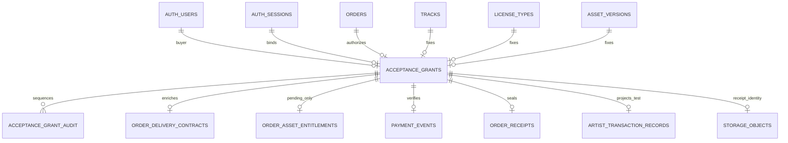

# Gate D D1 implementation review

## Scope and baseline

- Baseline commit: `e8abfb5253a6d23c515fe8cc8f76670f62281628`
- Baseline tree: `04eeb45e7d3977ec7c8adfa79f60923d5305e370`
- Branch: `codex/gate-d-acceptance-foundation`
- Runtime contract: production target, `production_beta`, Stripe TEST mode, `livePaymentsEnabled=false`, all six commerce capabilities OFF, global production adapter prohibited.
- D1 adds no fixture, grant, order, payment, receipt, entitlement, projection, capability change, public page, or live-payment path.

There are exactly two executable migrations. Migration A creates the two retained evidence tables and their database guards. Migration B creates the reviewed RPC boundary and exact EXECUTE grants. The cleanup draft is documentation at `docs/gate-d-d1/cleanup-migration-draft.sql`, outside `supabase/migrations`, and has not been executed.

## Schema

`acceptance_grants` has a constant-expression partial unique index over the five nonterminal states. Terminal history remains retained without blocking a separately authorized future grant. Immutable commercial facts never change. Attempt, Session, Checkout, payment, contract, entitlement, receipt, projection, and Storage identities are write-once. Deletes are rejected. `acceptance_grant_audit` has a closed event vocabulary, per-grant unique sequence, no JSON column, no lease token, no Stripe idempotency key, and no parameter digest.

## State transition matrix

| From | Allowed to | Required guard |
|---|---|---|
| `available` | `reserved` | exact Buyer, canonical role, live exact session, valid fixture/order |
| `available` | `expired`, `revoked` | terminal timestamp |
| `reserved` | `reserved` | same attempt; lease recovery only |
| `reserved` | `checkout_bound` | exact lease/epoch/digest/Session and pending trusted order |
| `reserved` | `revocation_requested` | controlled failure/operator path |
| `reserved` | `expired` | verified unpaid provider reconciliation |
| `checkout_bound` | `checkout_bound` | exact idempotent binding only |
| `checkout_bound` | `paid_verified` | signed TEST evidence and exact trusted facts |
| `checkout_bound` | `revocation_requested` | controlled failure/operator path |
| `checkout_bound` | `expired` | verified unpaid provider reconciliation |
| `revocation_requested` | `revoked` | verified unpaid provider reconciliation |
| `revocation_requested` | `paid_verified` | payment race plus mandatory security hold |
| `paid_verified` | `paid_verified` | exact replay only |
| `paid_verified` | `consumed` | complete final invariant |
| `consumed` | `consumed` | idempotent return |
| `expired`, `revoked` | same terminal state | late payment evidence retained plus hold; never reopened |

All other transitions fail in the grant trigger. A reserved or bound grant cannot move to expired without provider reconciliation. There is no transition back to `available`.

## Attempt and Checkout binding

The first reservation generates one immutable `attempt_id`, one immutable Stripe idempotency key, the authenticated Supabase session UUID, lease epoch 1, and a secret lease token. The authenticated RPC returns the attempt and epoch but never the lease token. Recovery retains the attempt and Stripe key while rotating the token and incrementing the epoch.

Before provider dispatch, the database freezes the exact canonical card-only Checkout parameters and SHA-256 digest. Application code independently recomputes the digest before calling Stripe. A retry uses the same parameters and idempotency key. The URL is returned only after the exact Session is durably bound. A provider timeout leaves the same attempt retryable. A binding failure with uncertain safe idempotency moves to operator reconciliation through the reviewed failure RPC.

## Webhook and fulfillment

Stripe signature and configured payment-mode checks remain before Gate D routing. Non-production or non-production-beta deployments bypass Gate D without a private RPC and retain the ordinary webhook flow. In production beta, only an exact stored `cs_test_…` Session selects Gate D. A valid order hint is a negative conflict detector only. Unbound events for retained Gate D orders fail retryably and cannot enter ordinary fulfillment. `event.account` is passed to the classifier and any Connect-originated event conflicts. Ordinary unbound Sessions retain the existing webhook flow.

A verified payment creates exactly four jobs. Gate D may claim `asset_preparation`, `receipt_generation`, and `transaction_projection`. The database rejects `entitlement_activation`, which remains pending with zero attempts and no lease. The final consume RPC also verifies that the activation job is untouched and `can_deliver=false`.

## Receipt and Artist record

Receipt text is normalized to printable ASCII, field lengths are bounded, PDF bytes are rendered in memory, raw angle brackets are removed, PDF metacharacters are escaped, total size is capped at 1 MiB, and `TEST - NOT A TAX INVOICE` appears twice on the single rendered page. The path is always `gate-d/<grant-uuid>/receipt-v1.pdf` in private `order-receipts`, with `upsert=false`.

Application code hashes before upload, downloads the exact path, verifies MIME, bytes, byte length, and SHA-256, and then asks the database to seal the exact Storage object ID/version. An existing object is adopted only after exact byte equality. Any mismatch applies a security hold and prevents seal/consume. No receipt UI is added.

The Artist projection contains a TEST payment record with `payable_earnings_calculated=false`. No Buyer billing identity, payout, settlement, balance, or earnings claim is added.

## Final consume invariant

One locked transaction verifies production/production-beta/TEST classification, provider account, QA Buyer, seller, approved track, active license and trusted price/currency, active fixture designation and asset identity, Session, PaymentIntent, signed event, order, delivery contract/context, generated noncommercial TEST agreement, sealed receipt and Storage identity, one TEST Artist projection, one pending noncommercial entitlement, dormant activation job, three completed allowed jobs, `can_deliver=false`, no hold, all six capabilities OFF, and logical uniqueness. Failure records `acceptance_invariant_failed` and leaves the grant unconsumed. Success records `acceptance_completed`, changes the state to `consumed`, then records `grant_consumed` in the same transaction.

## Deliberate stop point

No hosted migration, deploy, fixture seed, grant, Checkout, Storage mutation, adapter activation, or production action is part of D1. Security implementation review is required before isolated staging.
