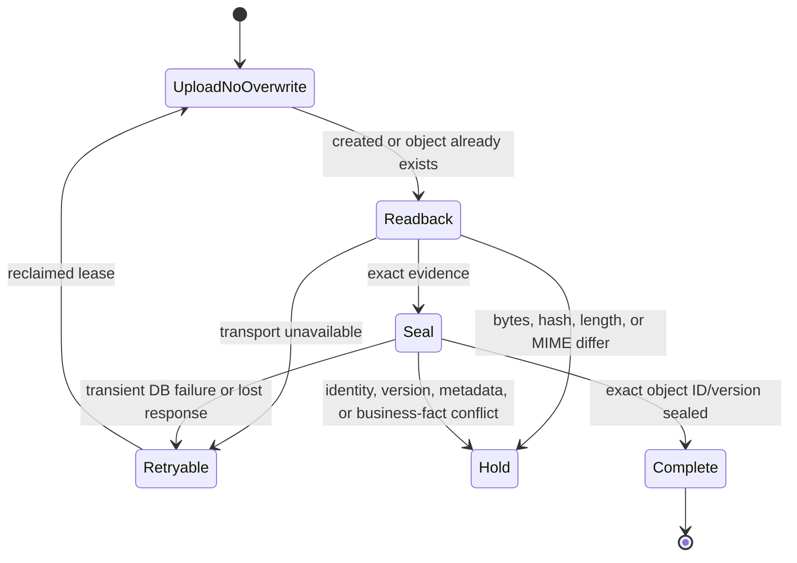

# Gate D D1 security remediation record

## Reviewed baseline and scope

- Original reviewed HEAD: `2162f772ad3f8db30e21e14f2eb9b67f2ac3ad30`
- Original tree: `49aa23e01052dce20070f1af2cc3c729e60b4748`
- Branch: `codex/gate-d-acceptance-foundation`
- Scope: five reported findings, PDF renderer decision, canonical migration manifest, and missing local security proofs only.

No hosted Supabase, Stripe, Storage, Netlify, fixture, grant, capability, adapter, production, or live-payment operation is part of this remediation.

## Finding remediation

### 1. Direct-account-only webhooks

Before: Checkout Connect context reached Gate D classification, and unknown Connect Sessions could reach ordinary routing.

After: after signature and mode validation, the webhook endpoint rejects every non-null `event.account` before hashing, classification, order lookup, ordinary fallback, or fulfillment. The database classifier independently rejects every non-null Connect account before Session or order lookup. Direct-account TEST behavior remains unchanged.

### 2. Complete Checkout request freeze

Before: the digest covered only mode, payment method, order, amount, currency, and expiry.

After: the database builds and persists one immutable canonical request specification and SHA-256 before provider dispatch. The application independently rebuilds the same object from trusted returned facts and its configured application origin, performs recursively key-sorted compact JSON serialization, and compares both exact serialization and digest before acquiring the Stripe client. The verified object is passed unchanged to `stripe.checkout.sessions.create()` with the original immutable idempotency key.

The specification contains every dispatched value:

```text
cancel_url
client_reference_id
expires_at
line_items[0].price_data.currency
line_items[0].price_data.product_data.description
line_items[0].price_data.product_data.name
line_items[0].price_data.unit_amount
line_items[0].quantity
mode
payment_method_types[0]
success_url
```

No customer/email behavior, metadata, or PaymentIntent data is sent. A future added Stripe parameter must be added to the canonical object or the tests/contract fail review.

### 3. Recoverable receipt sealing

Before: any readback or seal failure applied a permanent hold.

After: only evidence and integrity failures hold the grant. Storage transport errors and transient/lost database seal responses finish the current job retryably when possible. If that completion call also fails, the lease expires and remains reclaimable. A retry attempts the same deterministic path with `upsert=false`, downloads it again, verifies exact MIME/bytes/length/hash, and seals or adopts only the exact object. SQL integrity errors (`22023`, `23514`, `42501`, `P0002`), missing Storage identity, byte/hash/MIME mismatch, and business-fact/path mismatch hold.



### 4. Full terminal-event replay tuple

Exact replay now requires equality of provider (`stripe`), configured provider account, provider event ID, payment mode (`test`), `livemode=false`, delivery contract, Checkout Session, PaymentIntent, event type, `PAID` state, amount, refunded amount (`0`), currency, raw-body evidence SHA-256, `stripe_signature` verification method, and provider-created timestamp. Any difference is audited as `payment_evidence_conflict`; a hold is applied if none exists, while an existing terminal late-payment hold remains intact. Different evidence is never labeled an idempotent replay and never creates a second payment record through this boundary.

### 5. Audit actor attribution

The closed vocabulary is:

| Actor | Sources |
|---|---|
| `database_system` | grant creation trigger |
| `authenticated_buyer` | reservation, recovery, Buyer-triggered validation |
| `stripe_webhook` | verified payment, payment-failure revocation, webhook conflict/replay/holds |
| `service_worker` | checkout worker, fulfillment jobs, final invariant, worker holds |
| `operator` | explicit operator revocation request |
| `reconciliation` | provider-uncertain revocation and provider reconciliation |

The former generic `database_owner` label is removed. A verified `payment_failed` reason now records `stripe_webhook`.

## Dynamic security evidence

The local suites cover:

- Connect rejection for exact Gate D, unknown, ordinary, failed-payment, refund, dispute, unhandled, live, and malformed-account events.
- Individual local drift rejection for product title, license name, slug, application origin, product description, success path, cancel path, amount, currency, expiry, payment method, and order reference, plus deterministic property ordering and exact retry.
- Receipt upload/seal transient recovery, lost response, exact adoption, different bytes, wrong MIME, Storage identity/version conflict, missing identity, no overwrite, and no duplicate object creation.
- Stale checkout bind, checkout failure report, job finish, and receipt seal.
- Terminal expired/revoked late payment, exact full-tuple replay, distinct event ID, digest, event type, and provider timestamp.
- Final consume rejection when each reviewed environment, account, identity, commercial fact, asset, designation, payment, agreement, receipt, Storage, projection, entitlement, job, delivery, hold, capability, or logical-uniqueness invariant is independently broken.
- Dynamic job/grant/task/lease rejection plus static proof that every worker RPC joins grant, contract, event, job, receipt, and lease identities before mutation.

Hosted auth lifecycle proofs remain deferred until a repeat security implementation review authorizes isolated staging: fresh sign-in exposes `session_id`; refresh preserves it; a second sign-in changes it; revoked/deleted session reservation fails.

## Migration identity

- Migration A `20261004023232_gate_d_acceptance_schema.sql`: `4f4517421e83b1a02f6227753b7e4f7c70118042b696a1b6adbe157310a2ac81`
- Migration B `20261004023241_gate_d_acceptance_functions.sql`: `4d8ed789f5d938028fe86eacfaab14f424e3354761a5d3fe2a5761d1a3802dfc`

These values were rechecked after the final bypass review. That review found no actionable bypass or security issue. The canonical security manifest now records both exact executable migration hashes.
