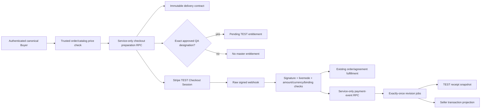

# Phase 2B payment-to-foundation adapters

## Scope

Phase 2B connects verified Stripe **TEST** events to the dormant Phase 2A purchase-completion foundation. It adds no buyer download, receipt, seller-transaction, notification, or hold-management UI. It does not backfill historical orders and grants no commercial rights.

The implementation starts from `main` at `d3ceda9de51c33b4fee05bed54c9b4ac1628de3e` on `codex/purchase-completion-fulfillment`.

## Important schema reconciliation

The Phase 2A contract cannot safely be created for the first time after payment. `commerce_private.freeze_contract` requires a pending order with no Checkout Session and deliberately freezes catalog, buyer, seller, rights, license, amount, currency, environment, and Stripe account facts **before** Stripe session creation.

Phase 2B therefore uses this order:

1. Authenticate the canonical buyer and load trusted catalog pricing.
2. Call `public.prepare_purchase_completion_checkout` through the server-only Supabase credential.
3. Freeze or reuse exactly one contract for the order.
4. Resolve an entitlement only when an exact approved asset-version/buyer QA designation already exists.
5. Create the Stripe Checkout Session.
6. After raw-body signature and `livemode=false` verification, persist the provider event through `public.record_purchase_completion_event`.

This keeps the immutable purchase-time snapshot trustworthy while retries still reuse the same logical contract.

## Adapter flow

## Public trusted database boundary

The `commerce_private` schema remains outside exposed PostgREST schemas. The migration adds narrowly scoped `public` `SECURITY DEFINER` functions that:

- explicitly require the JWT database role `service_role`;
- revoke execution from `PUBLIC`, `anon`, and `authenticated`;
- use an empty `search_path` and schema-qualified objects;
- derive contracts and stored provider bindings from the order ID;
- preserve Phase 2A locks, constraints, immutable triggers, leases, and worker fencing.

Canonical RPCs:

- `prepare_purchase_completion_checkout`
- `record_purchase_completion_event`
- `hold_purchase_completion`
- `claim_purchase_completion_job`
- `prepare_purchase_completion_receipt`
- `seal_purchase_completion_receipt`
- `finish_purchase_completion_job`

## Webhook event mapping

| Stripe event | Foundation state | Notes |
| --- | --- | --- |
| `checkout.session.completed` with `payment_status=paid` | `PAID` | Session, PaymentIntent, amount, currency, and order binding required |
| `checkout.session.async_payment_succeeded` | `PAID` | Same trusted binding as completed |
| `checkout.session.async_payment_failed` | `PAYMENT_FAILED` | No receipt or activation job |
| `charge.refunded` | `PARTIALLY_REFUNDED` or `REFUNDED` | Stored order session is derived server-side; entitlement suspends/revokes |
| `charge.dispute.created` | `DISPUTED` | Stored order session is derived server-side; entitlement suspends |

Only safe structured fields plus the SHA-256 of the signature-verified raw body are persisted. Raw webhook bodies, signatures, headers, customer billing data, and secrets are never stored in the foundation.

## Idempotency contract

- One immutable delivery contract per order (`order_id` unique).
- One provider event identity per Stripe account, payment mode, and provider event ID.
- Exact replay returns the existing event; conflicting replay fails.
- One logical job per contract/task/revision.
- Independent database connections serialize on the order-state row.
- Existing webhook activity dedupe does not bypass foundation reconciliation: an exact event can be re-submitted to the database adapter safely.
- There is no automatic application retry loop. Stripe delivery retries rely on database idempotency.

## Asset and entitlement rules

- The browser supplies no Storage path or asset ID.
- Real-catalog TEST purchases receive no master entitlement.
- A synthetic QA entitlement requires one and only one ready, approved, unretired, checksum-bound asset version for the frozen track plus an unrevoked designation for the exact buyer.
- The entitlement begins `pending` with `commercial_rights_granted=false`.
- Entitlement activation stays behind the separate Phase 2A activation capability.
- A hold, refund, dispute, asset retirement, or designation revocation prevents or removes delivery eligibility.

## Jobs, receipts, and seller projection

- A real-catalog paid event creates receipt and transaction-projection work only.
- A designated synthetic QA payment additionally creates asset-preparation and entitlement-readiness work.
- Receipt snapshots are immutable TEST receipts, not tax invoices. Artifact sealing remains private and checksum-bound.
- Seller projections contain track, license, date, gross transaction amount, currency, TEST classification, and payment state. They contain no buyer billing identity and never claim payout or earnings.
- Workers retain Phase 2A bounded attempts, leases, stale-worker fencing, and explicit terminal failures.

## Capability state

`payment_adapter_enabled` is an internal deployment-owner flag and defaults to `false`. It also requires `foundation_enabled=true`. Application configuration requires the exact string `true`, TEST payment mode, and a valid server-only `STRIPE_ACCOUNT_ID`. Missing, false, or malformed values keep the adapter OFF.

The following remain separate and default OFF:

- asset preparation
- receipt generation
- entitlement activation
- transaction projection

No flag is enabled by this source migration.

## Configuration

Server-only variables:

- `SYNC_EXCHANGE_PHASE2B_PAYMENT_ADAPTER_ENABLED`
- `STRIPE_ACCOUNT_ID`
- existing `SUPABASE_SERVICE_ROLE_KEY`
- existing Stripe TEST secrets

Neither Phase 2B value is public or embedded into client configuration. An explicitly enabled invalid configuration fails before Stripe checkout.

## Rollback and forward recovery

Before merge or production use, keep the adapter flag OFF. If a staging adapter fault occurs:

1. Set the application adapter flag OFF and disable `payment_adapter_enabled` with the deployment owner.
2. Leave immutable contracts, events, state history, and jobs in place as audit evidence.
3. Continue the existing order/agreement flow, which remains compatible when the adapter is OFF.
4. Reconcile the exact failed event and apply a reviewed forward fix. Do not delete or rewrite payment history.
5. Re-enable only after replay, concurrency, and binding tests pass.

Database rollback is not a data deletion procedure. Once Phase 2B rows exist, recovery is forward-only through disabled capabilities and corrected adapters.

## Validation evidence

Required local commands:

- `npm run test:unit`
- `npm run test:purchase-foundation`
- `npm run test:purchase-concurrency`
- `npm run typecheck`
- `npm run lint`
- `npm run build`
- `npm run verify:supabase`
- `git diff --check`

Hosted staging evidence must separately identify the exact commit, migration hash, staging project, staging Netlify deploy, Stripe TEST event, resulting contract/event/job counts, duplicate replay outcome, capability state, and cleanup result.
