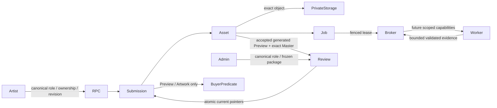

# Slice 3 foundation source review

Baseline main `69ed3fe6dd5e8b0c1642d0835e4e3f4075e796f0`, tree
`124442516c6af419ba31b6ce1d8f3495d08ed41a`. Branch
`codex/phase-2-slice-3-media-foundation`. Production remains at the previously verified
published source `e8abfb5253a6d23c515fe8cc8f76670f62281628`; no hosted changes occurred.
The final commit/tree are recorded in the authoring report, avoiding a self-referential hash.

## Source boundary

Three additive migrations, seven private lifecycle tables, worker profile/types only,
local PostgreSQL tests and narrowly extended existing migration security assertions.
No UI, application service rewrite, FFmpeg execution pipeline, worker deployment or
commerce behavior. No eighth table: derivatives are versioned assets with source FKs.

## Inventory and constraints

`submission_media.submissions`: submission UUID first, owner/optional unique track,
optimistic revision, working/accepted/current pointers, region checkpoint, managed-slot
flags and last save. No Rights/Licensing/Certification fields required. Kind-discriminator
composite FKs prohibit wrong-purpose or cross-submission pointers.

`assets`: immutable reservation/destination/object/version/checksum, kind, technical state,
measured audio/image metadata, generated source provenance, exact samples/region,
validator/profile/build version, immutable Artist acceptance and retention timestamps.
Composite source FK requires same-submission source_master. READY requires non-null
identity/checksum/version/validator evidence plus kind-specific technical bounds. Storage
object FK prevents dangling identity. Preview and waveform source/profile uniqueness.

`operations`: actor/action/key unique + SHA-256 request hash and durable safe outcome.
`jobs`: exact submission/asset/operation/kind/profile, one asset/type/profile job, attempts,
queue time, fenced token/epoch/expiry, bounded errors. `master_reviews`: immutable exact
Master/Preview package hash, one pending review/submission, expected current Master,
canonical Admin decision. `events`: append-only bounded allowlisted payload, correlation
and actor. `capabilities`: one singleton row, four false flags. All FKs retain evidence;
no media deletion cascade. This changes deletion behavior only after explicit adoption.

Technical states: reserved -> uploaded -> verifying -> ready/failed; generated assets can
reserved -> verifying; transient failure can verifying retry, expired reservations cannot
upload. READY evidence immutable. Technical READY, Artist accepted, reviewed and current
remain distinct. Superseded bytes remain READY evidence, publication determined by pointers.
No invented upload percentage/processing percentage. Jobs queued/running/retry_wait/
succeeded/failed back async states. Claim admission serialized briefly, processing separate.

## RPC and ACL matrix

All implementation routines: SECURITY DEFINER, empty search_path, fully qualified objects,
NOLOGIN NOBYPASSRLS executor owner; PUBLIC/anon/service_role execute revoked. Helper routines
have no external grants. Every table ENABLE + FORCE RLS; direct anon/authenticated/service
role/broker table access revoked. Executor-only policies with explicit ACLs; no DELETE.
Event UPDATE denied even executor, and trigger denies UPDATE/DELETE even privileged calls.
Capabilities executor read-only. Existing API roles do not inherit executor or broker.

| Caller/grant | Routines | Checks/mutation |
|---|---|---|
| authenticated, canonical Artist | media_create_submission; media_bind_track | Session UUID, canonical role, own track/submission; durable idempotent identity |
| authenticated, canonical Artist | media_reserve_asset | Only Master/Artwork enum, owner, revision, quota; derived immutable reservation, no client destination |
| authenticated, canonical Artist | media_request_legacy_adoption | Explicit own legacy relative path + exact object; no manufactured validation or auto adoption |
| authenticated, canonical Artist | media_select_preview_region; media_request_preview | READY exact source, authoritative duration/samples, waveform ready, revision, idempotency, profile uniqueness |
| authenticated, canonical Artist | media_accept_asset | READY Preview/Artwork, explicit acceptance; current-source Preview/Artwork can activate on approved track; candidate-source Preview stays private |
| authenticated, canonical Artist | media_request_master_review | New working Master, new accepted exact-source Preview, waveform READY, canonical review entry, frozen hash |
| authenticated, canonical Artist | media_retry_job | Owned failed retryable bounded attempt job + revision |
| authenticated, canonical Artist | media_read_submission; media_read_operation | Own safe state/outcome; no Storage identity/path/capability/job internals |
| authenticated, canonical Admin | media_admin_review_state; media_decide_master_review | Canonical role, frozen package, current pointer/revision, row locks; approve atomically, reject keeps old current |
| isolated broker role only | upload_destination; observe_upload | Exact reserved DB asset; observed Storage row/version/size/owner; no arbitrary bucket/path parameters |
| isolated broker role only | claim_job; heartbeat_job; complete_job | Trusted queue, bounded profiles/results, token/epoch/expiry fencing; late results cannot activate anything |
| isolated broker role only | buyer_media | Opaque current approved Preview/Artwork IDs only; no source delivery |

Helpers/trigger functions: require_actor, require_capability, lock_owned, begin_operation,
finish_operation, append_event, bump, check_region, package_hash, guard_asset, guard_review,
guard_submission, guard_event, supersede, asset_dto, guard_managed_track,
storage_insert_allowed and guard_storage_object. Only storage_insert_allowed additionally
granted to authenticated for the exact-reservation policy; its safe boolean is not a read API.

No generic update/set-state RPC. RPCs consolidate Master/Artwork reservation and
Preview/Artwork acceptance into strict purpose allowlists. All Artist mutations lock owned
submission first; idempotency outcome is returned before applying stale revision checks.
Retries with changed parameters fail, including different submission. Admin resolves review
then locks submission/track/review and rechecks immutable package/current version.

## Publication and compatibility

`buyer_media(track)` requires capabilities reads+activation, approved eligible track with
same owner, managed slot/current pointers, READY+accepted current derivative, sealed object
identity/version, current approved Master review and exact source dependency for Preview.
Generation alone never publishes. Artwork stays independent of pending Master review.
Approval switches Master+candidate Preview atomically. Old package remains active through
pending review/rejection. Approved Preview/Artwork-only changes keep track Approved.
Media guard blocks legacy path bypasses for managed slots even privileged writes. It is a
no-op for every unmanaged row, regardless of flags. No legacy path columns are rewritten.
Existing Buyer player can keep one safe URL/descriptor through a future read-through adapter.
No Source Master delivery, purchased entitlement, receipt or Gate D route is introduced.

Read-through + explicit lazy source verification only, no backfill. Unsupported/absolute
legacy sources remain compatible/read-only until replacement. Source adoption alone never
makes a slot managed or invents validation. A generated/accepted exact package must enter
canonical Admin review before initial management; this deliberately keeps old legacy
Preview provenance separate. Legacy Preview/Artwork bytes are not automatically adopted.
Future app adapter and minimal Admin compatibility are required before activation; the old
app would keep showing old legacy URLs on managed tracks, so capabilities must remain off
until the read-through consumer is ready. Installation does not create managed tracks.

Save/resume: create UUID; reserve/upload; observe; validate; waveform; select; generate;
listen/accept; reserve/validate/accept artwork; read durable checkpoint. Bind track only when
existing later-step workflow creates it. Leaving browser does not lose DB evidence. Network
uncertainty looks up operation/asset; never deletes uncertain objects. Initial Master review
requires track already pending_review/approved, preserving final submission separation.

## Threat model delta

| Threat | Controls | Residual / activation prerequisite |
|---|---|---|
| Cross-Artist / metadata spoof / ID substitution | Canonical profile, auth.uid, ownership before mutation/read, composite FKs | Server adapters must retain role checks |
| Arbitrary destination, stale token, overwrite, deletion | Derived reservation, exact RLS binding, privileged object trigger, immutable identity | Hosted Storage transaction/version semantics require isolated tests |
| Old Preview attached to replacement | Exact-source FK, source checksum/samples/profile, frozen package hash | Worker must actually decode/revalidate output |
| Parser exploit / resource abuse | Strict result bounds/profiles, quotas, fenced jobs; proposed isolated decoder | Parser/container not implemented; runtime limits/pinning need security review |
| Late/duplicate jobs and races | Unique operations/jobs/profiles, row locks, revisions, lease token+epoch | DB concurrency tests do not substitute for full Storage integration |
| Pending media disclosure | All future buckets private, no raw client reads, safe DTOs, explicit publication predicate | Signing broker/delivery endpoints not implemented |
| Worker compromise | NOLOGIN isolated broker has RPC-only rights; no table writes/commerce | Future signing broker may need isolated privileged Storage key |
| Audit leakage/tampering | Allowlisted bounded fields/errors, immutable events | Operator superuser remains trusted |
| Legacy bypass / dormant regression | Per-slot managed guard, no path rewrites/backfill, false flags | Managed app/edit/Admin adapters require separate work |

## Dormant installation delta and recovery

A: one new schema, two NOLOGIN roles, seven tables, constraints/indexes/FORCE RLS, executor
ACLs/policies and exactly one FALSE capability row. B: purpose-specific functions and five
private lifecycle triggers plus unmanaged-no-op public track trigger. C: seven new Storage
policies + one object guard; zero buckets. Three executor policies on profiles/tracks are
internal-role only; authenticated grants are function-only except safe schema usage.

Expected zero submissions/assets/operations/jobs/reviews/events; zero Storage objects or
bucket mutation; zero existing-track or commerce mutation; zero worker execution. No timer,
webhook, pg_cron or automatic historical backfill. Flag changes have no application caller.
Every migration transactional. B-before-A fails; A/B/C replay preserves singleton flags.
If B fails after A, keep A dormant and correct/retry B; no destructive rollback. If later
operation partially uploads, retain bytes and reconcile exact object/version, retry bounded
job; do not blind-delete evidence. Production install requires separate authorization,
exact manifest hashes, absent/present schema and role ACL preflight, zero rows, Storage
baseline/private-bucket inspection, writers/locks, backup, exact-head security approval,
current app health and confirmed false capabilities.

## Review and validation

Use `npm run test:submission-media` against disposable local PostgreSQL 17, not a hosted
DSN. Harness only connects Unix socket `/private/tmp`, port 55439, clears PG environment;
creates/drops uniquely named disposable databases, replays all migrations and synthetic
fixtures. Start a dedicated local cluster using initdb/pg_ctl; stop it after tests. No
hosted option exists. Tests include replay/order/dormancy, ACL/search_path/RLS, forged IDs,
reservation sealing, READY evidence, exact provenance, short cues, activation/review,
append-only audit, legacy compatibility and real independent-session concurrency.

Database tests validate **trusted result contracts**, not actual audio/image decoding.
Malformed/zero-frame/codec result failures are covered; actual synthetic media processing
is reserved for future worker authoring. Flags-off evidence: complete repository replay,
legacy SQL mutation/approved catalog visibility, unchanged application source and full
route build/regressions. Authenticated browser journeys against real hosted data are not
claimed and remain a future isolated staging gate.

Security review must cover every migration/role/ACL/RLS/definer/trigger, provenance,
substitution, publication, sealing, lease fencing and commerce separation at committed
exact HEAD. No automatic remediation of material review findings. PR #17 overlaps future
Artist workspace/shared player integration but no foundation SQL. PR #18's older media and
reviewed-rights migrations overlap existing reconciled protections; do not reintroduce
those historical bundles. Both overlap manifest/package/test inventories; future merge
must reconcile additively. No PR/branch content is overwritten here.

## Local authoring results

- Real PostgreSQL 17.11: 10 lifecycle/concurrency groups passed; four source/profile tests
  passed (`npm run test:submission-media`: 14 total). Full repository replay, B-before-A
  rejection and A/B/C repeat replay passed. Tests use real independent PostgreSQL sessions.
- Existing unit: 443 passed, including discovery, shared Preview security, Slice 2 purchases,
  Storage deletion and moderation. Artist baseline: 72 passed. Original Artist security gate:
  5 passed. PR2/security regressions: 65 passed. Assertions retained; exact migration and
  policy inventories extended additively (31 -> 34 migrations; legacy six policies unchanged).
- Typecheck passed; lint zero errors, one pre-existing React Hook Form warning at submission
  form line 173. `git diff --check` passed. Offline migration-manifest preflight: 34 hashes PASS.
- `npm run build` blocked by the safety script because an unrelated local dev server listens
  on port 3000. It was left untouched. `npx next build --webpack` passed in this isolated
  worktree with all application routes compiled. This is not an authenticated browser proof.
- Pinned install reported existing dependency advisories (2 moderate, 10 high, 1 critical);
  dependency versions/lockfile are unchanged. No npm audit auto-fix was run.

Four active reservations/unfinished uploads, 20 uploads/day, 20 new Preview regions/hour
and 50 new checkpoints/day are Artist-wide guardrails, not paid-plan restrictions. Quota
admission uses an owner advisory lock before row locks. Worker admission permits one active
job/Artist and serializes only the short claim transaction. Superseded retained Storage grows
with editing: future GC separate; no destructive cleanup exists in this branch.

The role owner/membership and Storage schema permissions available to the future hosted
migration operator must be verified before installation. Local tests use a disposable
superuser operator and do not establish hosted operator ACL parity. No hosted preflight was
run. Future application, signing broker, worker/parser, Admin adapter and isolated-platform
TUS tests remain explicit dependencies before activation.
